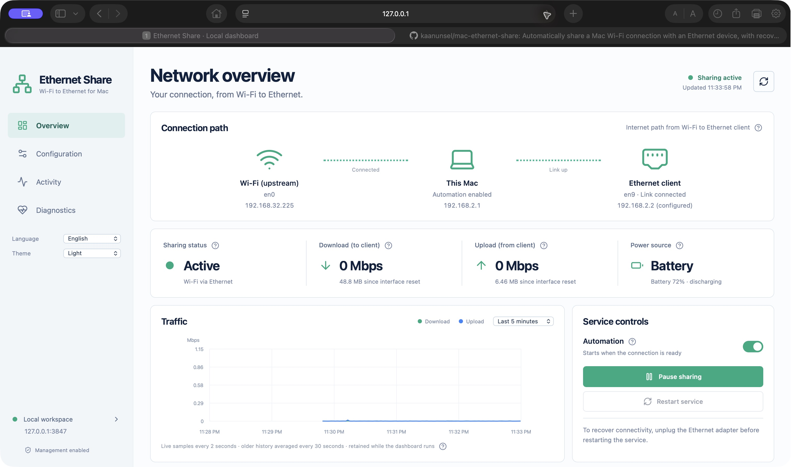

# Mac Ethernet Share

Automatically share a Mac's Wi-Fi connection with one Ethernet device, such as a PS5. Plug in the configured adapter and connect the device; the service starts sharing when Wi-Fi and the Ethernet link are ready.



## Why this project exists

My PS5 could not join my university's eduroam Wi-Fi, so I connected it through my MacBook and a USB Ethernet adapter. I built this to make sharing automatic instead of repeating network and power commands each time. It also works with other Ethernet devices that support manual IPv4 settings.

## Requirements

- macOS, Xcode Command Line Tools (`xcode-select --install`), and administrator access.
- A working Wi-Fi connection and a macOS-supported Ethernet adapter.
- An Ethernet device that supports a static IPv4 address.
- Node.js 20.19+ (or 22.12+) and npm **only if you want the dashboard**.

## Install

```bash
git clone https://github.com/kaanunsel/mac-ethernet-share.git
cd mac-ethernet-share
networksetup -listallhardwareports
cp Configuration.example.swift Configuration.local.swift
```

Edit `Configuration.local.swift`: set `ethernetMAC` to the **Mac adapter's** Ethernet Address from `networksetup`, and `upstreamInterface` to the Wi-Fi device name (usually `en0`). Then run:

```bash
bash tests/check.sh
sudo bash install.sh
./ethernet-share.sh start
```

A fresh install starts paused until `start` is run. Sharing starts when the selected adapter, its cable, and the Wi-Fi upstream are ready.

Set these **manual IPv4 settings on the Ethernet device**:

| Setting | Value |
| --- | --- |
| IP address | `192.168.2.2` |
| Subnet mask | `255.255.255.0` |
| Gateway/router | `192.168.2.1` |
| DNS | `1.1.1.1`, `8.8.8.8` |

The subnet is fixed at `192.168.2.0/24`. The service supports one client; it does not provide DHCP or IPv6 routing. Before sharing starts, the adapter must not have another IPv4 address or a conflicting route.

## Dashboard

```bash
./dashboard.sh install
./dashboard.sh open
```

`install` starts the local dashboard at [http://127.0.0.1:3847](http://127.0.0.1:3847) and adds a login item. Use `open` for the first visit in each browser, then select **Enable management** and approve the macOS administrator prompt to unlock controls and protected logs. The dashboard runs only on this Mac.

The dashboard shows live connection status, traffic, activity, and diagnostics. It also has configuration and service controls, English/Turkish language selection, light/dark themes, and explanations for network terms. Traffic history reaches six hours while the dashboard service runs; it resets when that process restarts.

If you prefer `ethernetshare dashboard`, add this alias to `~/.zshrc` using the absolute path to your clone, then open a new terminal:

```bash
alias ethernetshare='/absolute/path/to/mac-ethernet-share/ethernet-share.sh'
```

## Everyday commands

```bash
./ethernet-share.sh status   # Check the connection
./ethernet-share.sh logs     # Follow service logs; Ctrl+C to exit
./ethernet-share.sh stop     # Pause sharing until start or the next reboot
./ethernet-share.sh start    # Resume automatic sharing
./ethernet-share.sh restart  # Unplug the adapter first, then recover and restart
```

While automation is enabled and the adapter is attached, the service prevents system sleep even on battery or with the lid closed; removing the adapter or pausing restores the previous setting. Battery use can increase. Do not use another router or macOS Internet Sharing on the same adapter/subnet; VPN routes that replace the primary Wi-Fi interface are unsupported.

## Update, troubleshoot, or remove

For a code update with the same configuration, run `bash tests/check.sh` and `sudo bash install.sh`. You can also use **Configuration → Service maintenance → Install service update** in the dashboard. An upgrade may briefly interrupt sharing.

Start troubleshooting with `./ethernet-share.sh status` and `./ethernet-share.sh logs`. If the dashboard reports **untracked forwarding** after upgrading from an older build, wait until the client can disconnect, then reboot the Mac to clear stale network state. To restart a stuck service, unplug the adapter and run `./ethernet-share.sh restart`.

Before changing the configured adapter or upstream, stop and uninstall the old service, edit `Configuration.local.swift`, then build and install again:

```bash
./ethernet-share.sh stop
sudo bash uninstall.sh
bash tests/check.sh
sudo bash install.sh
./ethernet-share.sh start
```

`./dashboard.sh uninstall` removes the dashboard login item without changing the sharing service. Disable management in the dashboard first if you also want to stop its privileged helper.

## License

MIT. See [LICENSE](LICENSE).
